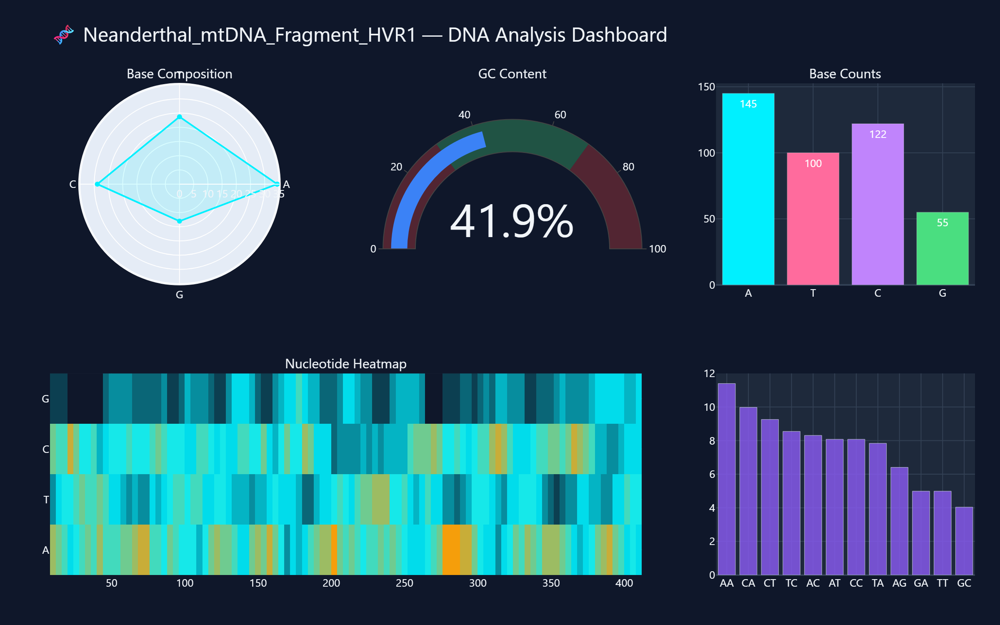
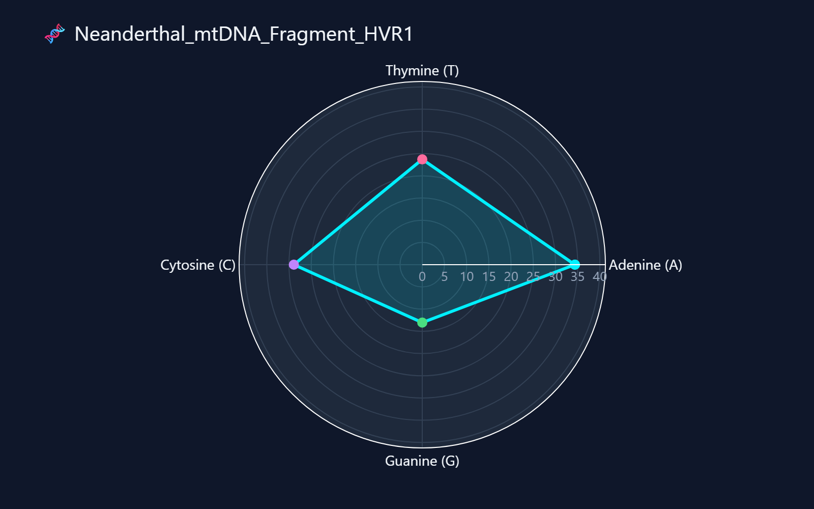
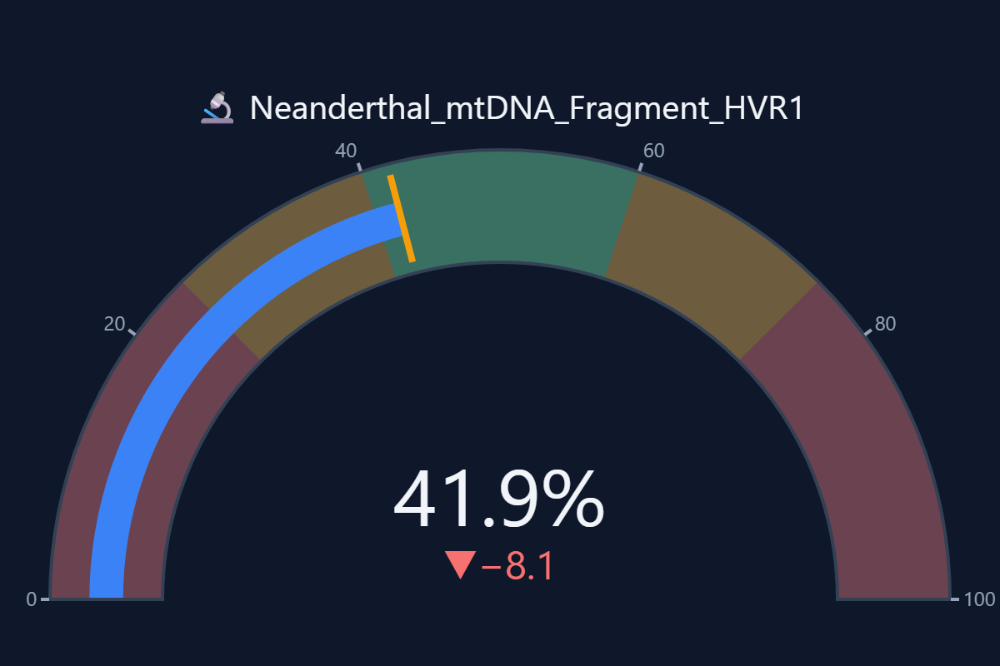
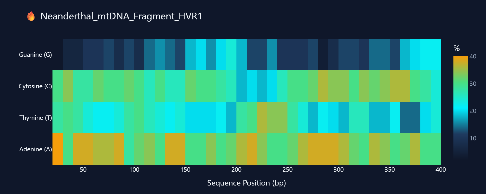
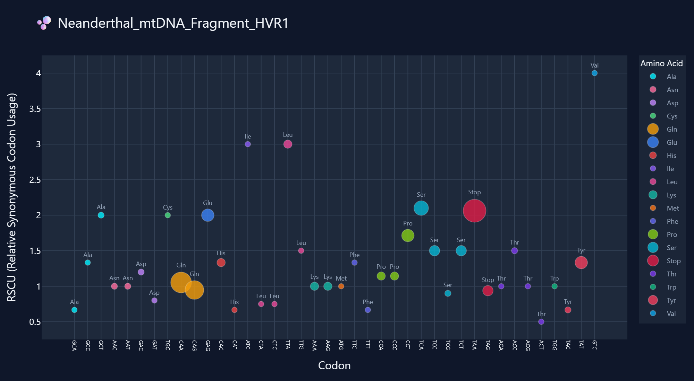
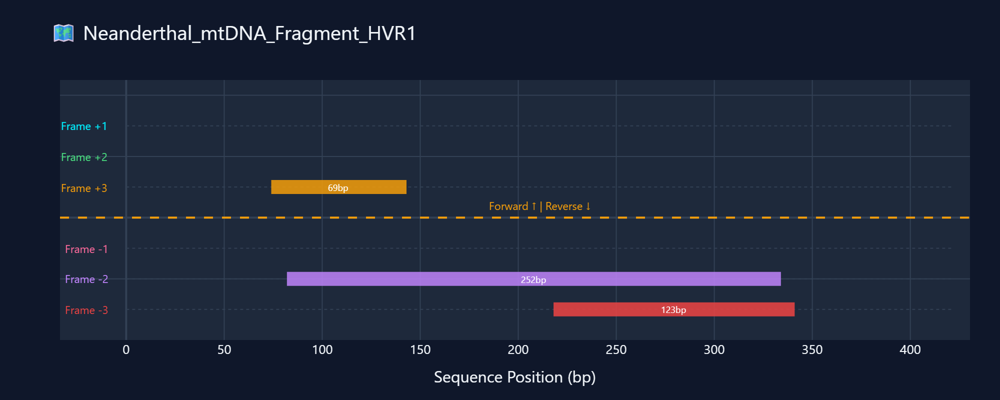
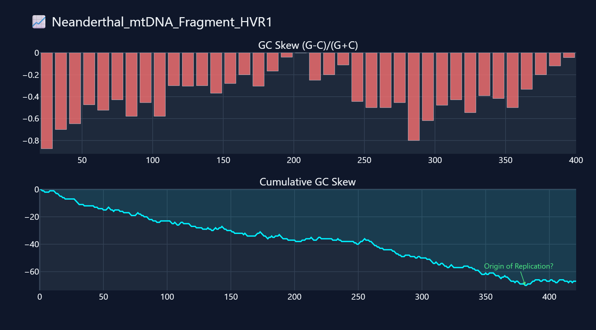
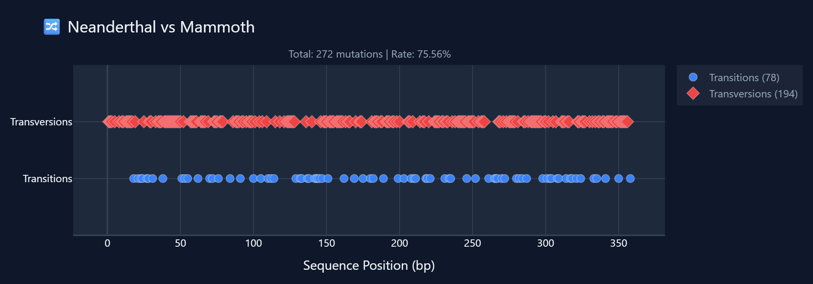
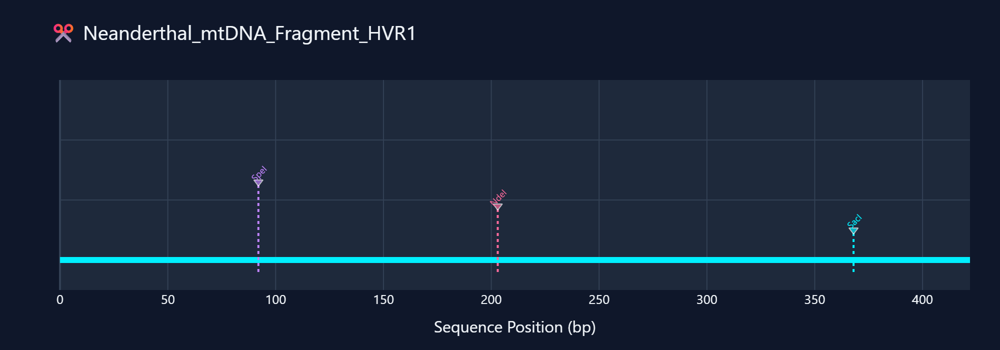
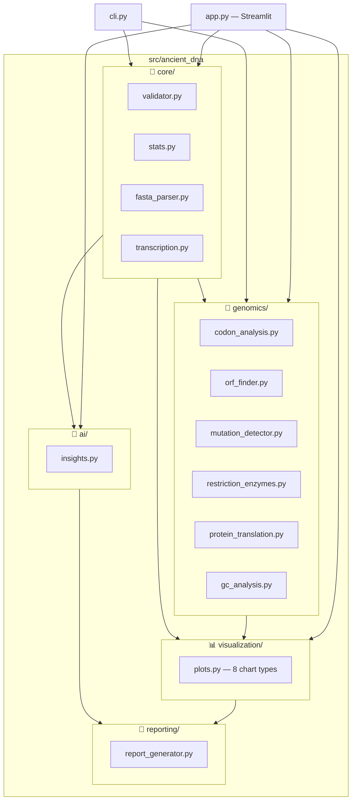

<p align="center">
  
</p>

<h1 align="center">Ancient DNA Analyzer</h1>
<p align="center">
  <b>AI-Powered Paleogenomics Toolkit</b><br/>
  <i>Analyze ancient DNA sequences with genome engineering tools, premium visualizations, and LLM-powered insights</i>
</p>

<p align="center">
  
  
  
  
  
  
</p>

---

## 🔬 What Is This?

A comprehensive Python toolkit for analyzing **ancient DNA sequences** from extinct species (Neanderthals, Mammoths, Cave Bears, Denisovans). It combines classical bioinformatics with modern AI to provide:

- **Nucleotide statistics** — base composition, GC content, dinucleotide frequencies
- **Genome engineering tools** — ORF finding, codon analysis, protein translation, mutation detection, restriction enzyme mapping, GC skew analysis
- **Premium visualizations** — 8 interactive dark-themed Plotly charts
- **AI-powered insights** — genomic analysis via local LLMs (Ollama)
- **Web dashboard** — Streamlit-powered multi-page interface
- **CLI interface** — command-line tool for batch analysis

---

## 📊 Visualizations

<details open>
<summary><b>Full Analysis Dashboard</b></summary>



</details>

<details>
<summary><b>Base Composition Radar Chart</b></summary>



</details>

<details>
<summary><b>GC Content Gauge</b></summary>



</details>

<details>
<summary><b>Nucleotide Distribution Heatmap</b></summary>



</details>

<details>
<summary><b>Codon Usage Bubble Chart</b></summary>



</details>

<details>
<summary><b>Open Reading Frame Map</b></summary>



</details>

<details>
<summary><b>GC Skew Analysis</b></summary>



</details>

<details>
<summary><b>Mutation Comparison Map</b></summary>



</details>

<details>
<summary><b>Restriction Enzyme Map</b></summary>



</details>

---

## 🏗️ Architecture



---

## 🚀 Quick Start

### Installation

```bash
# Clone the repository
git clone https://github.com/rudra0812/ancient-dna-analyzer.git
cd ancient-dna-analyzer

# Create virtual environment
python -m venv .venv
source .venv/bin/activate  # Linux/Mac
# .venv\Scripts\activate   # Windows

# Install dependencies
pip install -r requirements.txt
```

### Option 1: Web Dashboard (Streamlit)

```bash
streamlit run app.py
```

Opens a premium dark-themed dashboard at `http://localhost:8501` with:
- 📊 **Dashboard** — Statistics cards, radar charts, heatmaps, GC gauge
- 🔬 **Genome Engineering** — Codon analysis, protein translation, ORF finding
- 🔀 **Sequence Comparison** — Mutation detection and Ti/Tv analysis
- 🤖 **AI Insights** — LLM-powered genomic analysis

### Option 2: Command Line

```bash
# Analyze a FASTA file
python cli.py analyze --fasta data/samples/sample_sequences.fasta --report

# Analyze a raw sequence
python cli.py analyze --sequence "ATGCGATCGATCGATCG"

# Compare two sequences
python cli.py compare file1.fasta file2.fasta

# Show info
python cli.py info
```

### Option 3: Python API

```python
from src.ancient_dna.core import validate_dna_sequence, calculate_dna_stats, read_fasta_file
from src.ancient_dna.genomics import find_orfs, codon_usage_table, detect_mutations

# Load and analyze
sequences = read_fasta_file("data/samples/sample_sequences.fasta")
for name, seq in sequences.items():
    stats = calculate_dna_stats(seq)
    print(f"{name}: {stats['length']} bp, GC={stats['gc_content']}%")

    orfs = find_orfs(seq, min_length=30)
    print(f"  Found {len(orfs)} ORFs")
```

---

## 🧬 Modules Reference

### Core (`src/ancient_dna/core/`)

| Module | Functions | Description |
|--------|-----------|-------------|
| `validator.py` | `validate_dna_sequence()` | Validates sequences (strict + IUPAC modes) |
| `stats.py` | `calculate_dna_stats()` | Base counts, GC%, AT/GC ratio, dinucleotide freq |
| `fasta_parser.py` | `read_fasta_file()`, `read_fasta_generator()` | Parse FASTA files (eager + lazy) |
| `transcription.py` | `transcribe_dna_to_rna()`, `reverse_complement()`, `complement_strand()` | DNA→RNA, strand operations |

### Genomics (`src/ancient_dna/genomics/`)

| Module | Functions | Description |
|--------|-----------|-------------|
| `codon_analysis.py` | `count_codons()`, `codon_usage_table()`, `codon_bias_score()` | Codon frequency, RSCU, bias scoring |
| `orf_finder.py` | `find_orfs()`, `get_longest_orf()`, `orf_summary()` | ORF detection across 6 reading frames |
| `mutation_detector.py` | `detect_mutations()`, `mutation_rate()`, `classify_mutations()` | SNP detection, Ti/Tv classification |
| `restriction_enzymes.py` | `find_cut_sites()`, `digest_sequence()`, `restriction_map()` | 16 enzyme database, digestion simulation |
| `protein_translation.py` | `translate()`, `six_frame_translation()`, `find_proteins()` | Standard genetic code, protein finder |
| `gc_analysis.py` | `gc_skew()`, `sliding_window_gc()`, `cumulative_gc_skew()` | GC content & skew analysis |

---

## 🤖 AI Insights (Optional)

AI-powered analysis requires [Ollama](https://ollama.com/) running locally:

```bash
# Install Ollama (see ollama.com)
ollama serve          # Start the server
ollama pull llama3.2  # Download the model
```

The analyzer gracefully falls back to rule-based analysis if Ollama is not available.

---

## 🧪 Testing

```bash
# Run all tests
python -m pytest tests/ -v

# Run with coverage
python -m pytest tests/ -v --cov=src/ancient_dna

# Run specific test file
python -m pytest tests/test_validator.py -v
```

---

## 📁 Project Structure

```
ancient-dna-analyzer/
├── src/ancient_dna/          # Main package
│   ├── core/                 # Validation, stats, parsing, transcription
│   ├── genomics/             # 6 genome engineering modules
│   ├── visualization/        # Premium Plotly charts
│   ├── ai/                   # Ollama LLM integration
│   └── reporting/            # Report generation
├── tests/                    # 100+ unit tests
├── data/samples/             # Sample FASTA files
├── docs/screenshots/         # Visualization screenshots
├── app.py                    # Streamlit web dashboard
├── cli.py                    # Command-line interface
├── requirements.txt          # Dependencies
├── pyproject.toml            # Python packaging config
└── LICENSE                   # MIT License
```

---

## 📄 License

MIT License — see [LICENSE](LICENSE) for details.

---

<p align="center">
  Built with 🧬 by <a href="https://github.com/rudra0812">rudra0812</a>
</p>
